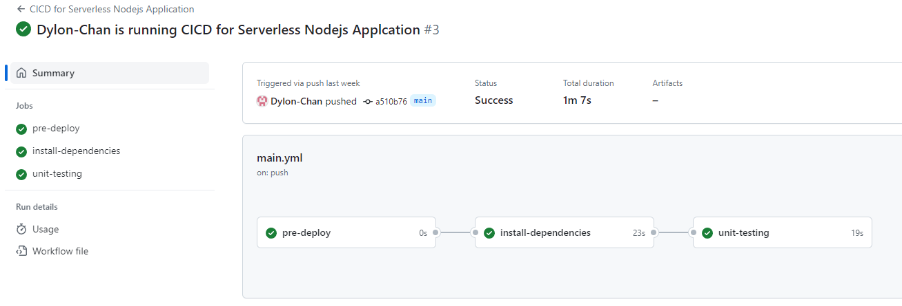
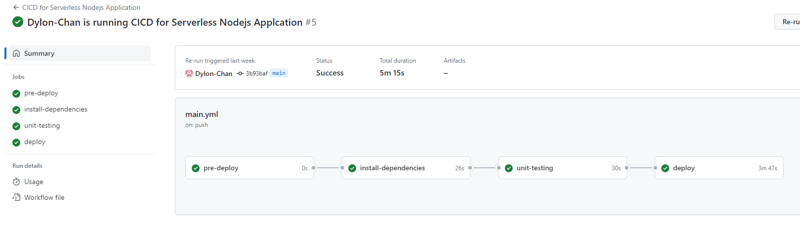
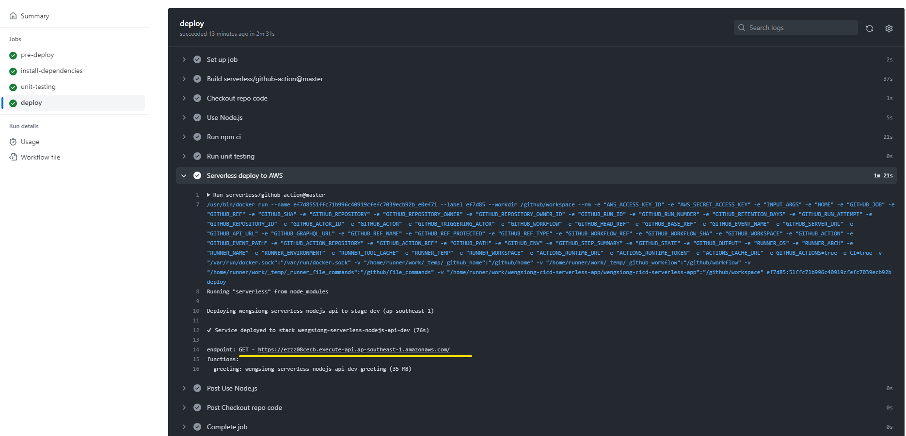
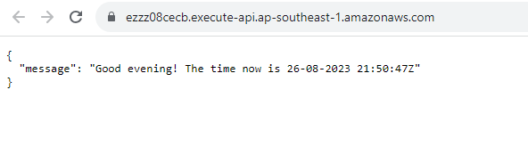

# CI/CD Pipeline for Serverless Nodejs Application

Welcome to this guide on setting up a Continuous Integration and Continuous Deployment (CI/CD) pipeline for a serverless Node.js application hosted on AWS Lambda. As serverless architectures become more popular due to their scalability and cost-effectiveness, the importance of a robust CI/CD pipeline has never been more paramount. This ensures that every piece of code deployed to production is of the highest quality, secure, and free from vulnerabilities.

By going through this guide, you will be:
- Creating a simple Node.js application that provides personalized greetings based on the Singapore timezone.
- Setting up a CI/CD pipeline using GitHub Actions, which will handle tasks such as dependency installation and unit testing.
- Deploying the application seamlessly to AWS Lambda with the Serverless Framework.

## Prerequisites

Before diving into the pipeline setup, make sure you have the following prerequisites satisfied:
- Nodejs installed
- Serverless Framework installed
- AWS Account
- AWS credentials stored in Github Secrets (Access and Secret Access keys required)

## Nodejs Application

This Node.js application serves as a simple API using AWS Serverless Lambda functions. When invoked, it provides a greeting to users with "Good morning," "Good afternoon," or "Good evening" based on the current time in Singapore.

To achieve this, I have leveraged the `date-fns` and `date-fns-tz` libraries to manage and manipulate date and time data effectively. The Lambda function returns a response with the personalized greeting and also includes the current date and time in the `Asia/Singapore` timezone.

## Steps to Build and Set Up the CI/CD Pipeline

### Build the Nodejs Application:

1. Start with the Node.js application in this repository.
2. Navigate to the root directory of the repository and install the required dependencies:
```bash
npm init           # Initialize the Nodejs application
npm install       # Install the dependencies
npm install date-fns date-fns-tz  # Install date-fns and date-fns-tz
```
3. Create the `index.js` file with the codes found in the [index.js](./index.js) in this repository or create your own Nodejs application.

### Build Unit Test:

1. To set up the testing environment, install the required testing framework and utilities:
```bash
npm install --save-dev jest
```
2. Modify and update the package.json file to add the test script.
```json
"scripts": {
    "test": "jest"
  },
```
3. Create the test file `index.test.js` with the code found in the [index.test.js](./index.test.js) file in this repository or create your own test file.
4. Test the application locally:
    - Run `npm test` which triggers the jest testing framework to run your tests.

### Set up Github Action workflow:

1. Create a workflow YAML file and the path should be `.github/workflows/main.yml` with the code below. This workflow is designed to automatically install the required dependencies, execute unit tests and report on the test results.
```yaml
name: CICD for Serverless Nodejs Application
run-name: ${{ github.actor }} is running CICD for Serverless Nodejs Applcation

on:
  push:
    branches: [ main, "*" ]

jobs:
  pre-deploy:
    runs-on: ubuntu-latest
    steps:
      - run: echo "The job is automatically triggered by a ${{ github.event_name }} event."

  install-dependencies:
    runs-on: ubuntu-latest
    needs: pre-deploy
    steps:
      - name: Checkout repo code
        uses: actions/checkout@v3
      - name: Install dependencies
        run: npm install
  
  unit-testing:
    runs-on: ubuntu-latest
    needs: install-dependencies
    steps:
      - name: Checkout repo code
        uses: actions/checkout@v3
      - name: Install dependencies
        run: npm install
      - name: Run unit testing
        run: npm test
```
2. Commit and push the changes to the `main` branch using:
```bash
git add .
git commit -m "Add Github Action workflow"
git push
```
3. Navigate to the Actions tab within the GitHub repository to monitor the status of the workflow.
4. You should see the workflow running and the test passed as shown below.



### Setup AWS Lambda Deployment using Serverless Framework

1. Install the Serverless Framework globally and the plugin for offline development.
```bash
npm install -g serverless
npm install --savedev serverless-offline
```
2. Create a new Serverless configuration file named `serverless.yml` with the code below. This file dictates how the Serverless Framework should deploy the application to AWS Lambda.
```yaml
service: wengsiong-serverless-nodejs-api
frameworkVersion: '3'

provider: 
  name: aws
  runtime: nodejs18.x
  region: ap-southeast-1
  deploymentBucket:
    name: cohort2.serverless.deploys

functions:
  greeting:
    handler: index.lambdaHandler
    events:
      - httpApi:
          path: /
          method: get

plugins:
  - serverless-offline
```

### Add Deployment on AWS Lambda to the CICD

1. Add the following code for the new job `deploy` to `.github/workflows/nodejs.yml`. This workflow automates the application deployment to AWS Lambda using the Serverless Framework and retrieves the secret from AWS Secrets Manager.
```yaml
  deploy:
    runs-on: ubuntu-latest
    needs: unit-testing
    steps:
      - name: Checkout repo code
        uses: actions/checkout@v3
      - name: Use Node.js ${{ matrix.node-version }}
        uses: actions/setup-node@v3
        with:
          node-version: ${{ matrix.node-version }}
      - run: npm ci
      - name: Run unit testing
        run: npm test
      - name: Serverless deploy to AWS
        uses: serverless/github-action@master
        with:
          args: deploy
        env:
          AWS_ACCESS_KEY_ID: ${{ secrets.AWS_ACCESS_KEY_ID }}
          AWS_SECRET_ACCESS_KEY: ${{ secrets.AWS_SECRET_ACCESS_KEY }}
```
2. Commit and push the changes to the `main` branch.
3. Navigate to the Actions tab of the repository to check the workflow's progress.
4. You should see the workflow running with the test and scans passed as shown below.



### Application Endpoint Access

1. Click on the URL displayed in the workflow log to access the application endpoint.



2. You should see the application response as shown below.



## Next Steps

1. Monitoring and Logging: 

    Integrate monitoring tools like AWS CloudWatch or third-party solution such as Datadog. This will allow us to keep track of the performance and health of our serverless application.

2. Vulnerability Scanning:

    Integrate vulnerability scanning tools like Snyk to scan for vulnerabilities in our application dependencies. This will ensure that our application is free from vulnerabilities and security risks.

## References

- https://date-fns.org/docs/Getting-Started
- https://www.npmjs.com/package/date-fns
- https://www.npmjs.com/package/date-fns-tz
- https://www.serverless.com/framework/docs/getting-started
- https://dev.to/aws-builders/setup-cicd-for-your-aws-lambda-with-serverless-framework-and-github-actions-4f12